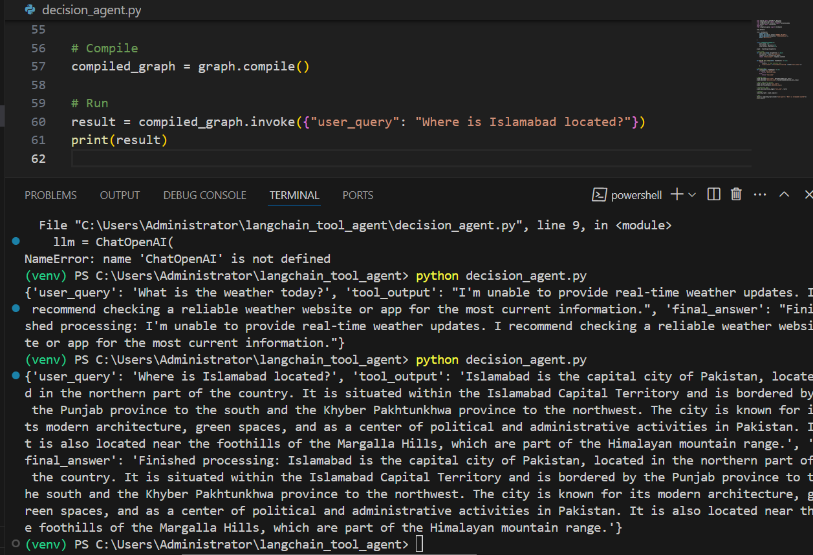

## 🧠 Decision-Making Agent with LangGraph

This project demonstrates a decision-making agent built using [LangGraph](https://docs.langchain.com/langgraph/), capable of handling user queries through conditional flows and external tool invocations.

---

## 🔍 Features

- Dynamic LangGraph flow with tool calling and decision nodes
- Conditional branching based on LLM output
- Uses OpenRouter LLM API for realistic responses
- Output preview image included

---

## 📁 Project Structure

langchain_tool_agent/
├── decision_agent.py # Main script with LangGraph logic
├── .env # Environment variables (API keys, etc.)
├── images/
│ └── p-3.PNG # Output preview screenshot
├── requirements.txt # Python dependencies

yaml
Copy
Edit

---

## 🖼️ Output Preview



---

## ⚙️ How to Run

### 1. Clone the repository
```bash
git clone https://github.com/FatimaRana50/Decision-Making-Agent-with-Langraph.git
cd Decision-Making-Agent-with-Langraph
```

2. Set up your environment

```
python -m venv venv
venv\Scripts\activate    # On Windows
```

3. Install dependencies
   
```
pip install -r requirements.txt
```
4. Add your API keys to .env
Create a .env file with the following:

```
OPENAI_API_KEY=your_openrouter_key
OPENAI_BASE_URL=https://openrouter.ai/api/v1
```

5. Run the agent
```t
python decision_agent.py
```
📬 Example Output
```
{
  "user_query": "What is the weather today?",
  "tool_output": "I'm unable to provide real-time weather updates. I recommend checking a reliable weather website or app for the most current information.",
  "final_answer": "Finished processing: I'm unable to provide real-time weather updates. I recommend checking a reliable weather website or app for the most current information."
}
```
## 🛠️ Tech Stack
LangGraph

LangChain Core

Python 3.10+

OpenRouter (LLM API)

dotenv
