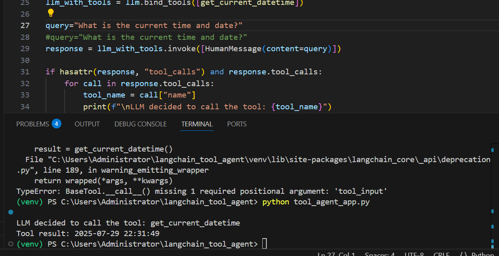
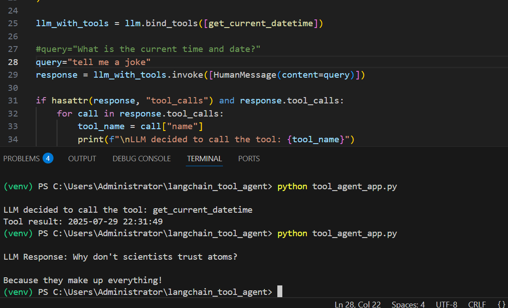

## LangChain Tool Calling Agent (OpenRouter Edition)

This project demonstrates how to create a simple **LangChain agent with tool calling support** using a **custom tool** and **OpenRouter API** instead of the default OpenAI API. The agent can respond to natural language queries and call tools when needed.

##  Features

- Uses **LangChain** with a **custom `get_current_datetime` tool**
- Hosted via **OpenRouter** (free OpenAI alternative)
- Demonstrates **tool calling** vs. **normal text response**
- Structured with `.env` and `requirements.txt` for easy setup

---

##  Previews

###  When the tool *was* called (`get_current_datetime`)


###  When the tool *was not* called (random query)


---

##  Tool Description

A simple tool `get_current_datetime()` was created and decorated using the `@tool` decorator from LangChain:

```python
@tool
def get_current_datetime() -> str:
    """Get the current time."""
    return datetime.now().strftime("%Y-%m-%d %H:%M:%S")
```
This tool was then bound to the LLM using llm.bind_tools([get_current_datetime]), enabling LangChain to call it only if the query requires current date/time info.

 How It Works
If the user's query requires the current time, the LLM calls the tool.

If not, the LLM replies directly.

Tool use is visible via response.tool_calls.

 File Structure

├── tool_agent_app.py        # Main script with tool and agent logic
├── requirements.txt         # Python dependencies
├── .env                     # Your API keys and base URLs
├── images/
│   ├── p-1.PNG              # Screenshot: Tool was used
│   └── p-2.PNG              # Screenshot: Tool was not used
└── README.md

 .env Example
```
OPENAI_API_KEY=my_openrouter_key
OPENAI_BASE_URL=https://openrouter.ai/api/v1
```
 requirements.txt

```
langchain
langchain-core
langchain-openai
python-dotenv
```
 Running the App

```
# Create virtual environment
python -m venv venv
venv\Scripts\activate  # or source venv/bin/activate on Linux/macOS
```
# Install dependencies
```
pip install -r requirements.txt
```
# Run the tool agent
```
python tool_agent_app.py
```
 Sample Queries
```
Query	Tool Used?
"What is the current time and date?"	 Yes
"What is the meaning of life?"	 No
```
 Why Use Tools with LLMs?
Tool use allows language models to:

Access real-time information (e.g., date/time, search)

Perform specialized operations (e.g., math, database queries)

Be more trustworthy and context-aware

 Challenges Faced

Challenge
LangChain deprecation warning for tool calling	

Solution

Used .invoke() instead of direct __call__()

Challenge

Error using OpenRouter	
Solution

Ensured correct .env values and base URL

Challenge

Free API option needed

Solution

Replaced OpenAI with OpenRouter for free usage